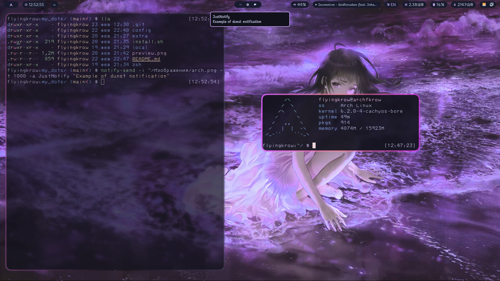

# dotfiles
## My dotfiles on Arch Hyprland

Before start ***make sure you backup your previous config files!***

To install - clone this repo to some temp folder (like ~/.tmp/) by this command and follow simple steps:

`git clone https://github.com/FlyingKrow/dotfiles ~/.tmp/fdots`

1. `cd ~/.tmp/fdots`
2. `chmod +x install.sh`
3. `./install.sh`

### It's not full install!

If you want to use my .zshrc configuration, then copy `./zsh/zshrc` to your home directory manually

You need to manually install some fonts and packages for correct work:

**Fonts:**
1. Fira Code (not necessary now)
2. Symbols Nerd Mono
3. 3270 Nerd Mono
4. Shantell Sans Regular/Light

**Packages:**
1. dunst
2. hyprpaper & mpvpaper
3. wl-clipboard
4. udiskie
5. rofi
6. calcurse
7. pavucontrol
8. grim & slurp (grim is for screen capture and slurp is for select region)
9. wob

#### This dots will update sometimes!
